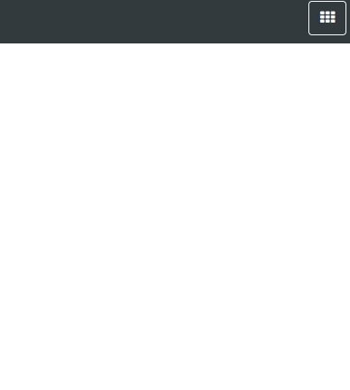

# Apps Launchpad
This application aims to create a web component that has the same behavior of google launchpad.
See the main google page with shortcut in top right

## Usage
The tag for the custom component:
```angular2html
<apps-launchpad></apps-launchpad>
```
you can project your custom button using
```angular2html
<apps-launchpad>
  <button slot="toggle-button"
      type="button" class="btn btn-primary">
    <span class="fa fa-th"></span>
  </button>
</apps-launchpad>
```

so you can use whatever style you want for the toggle button.

## Screenshot


